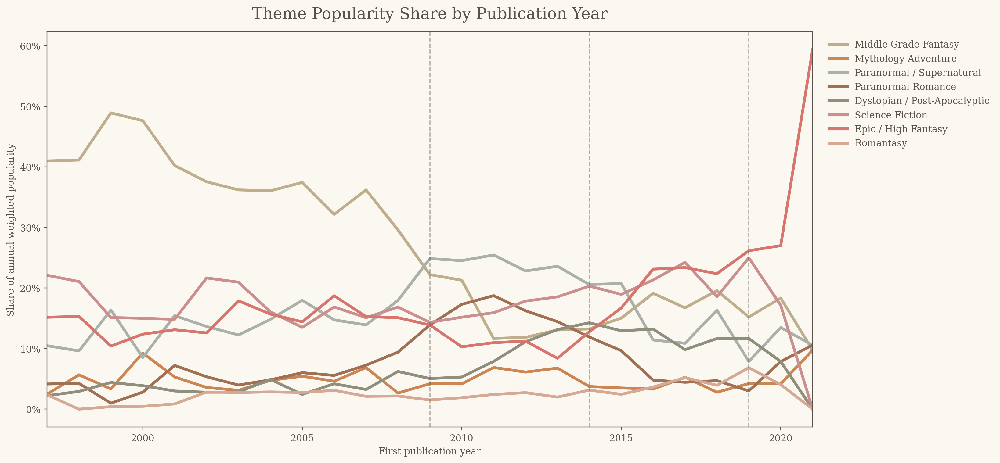
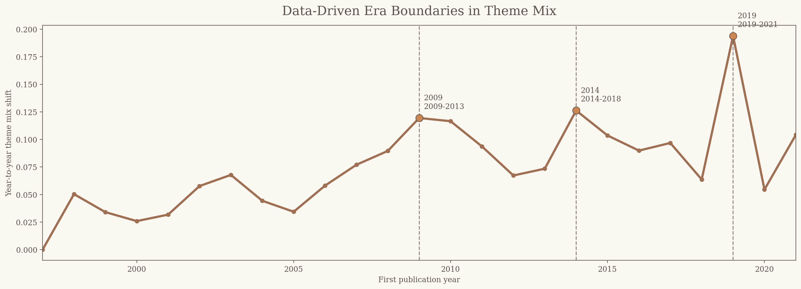
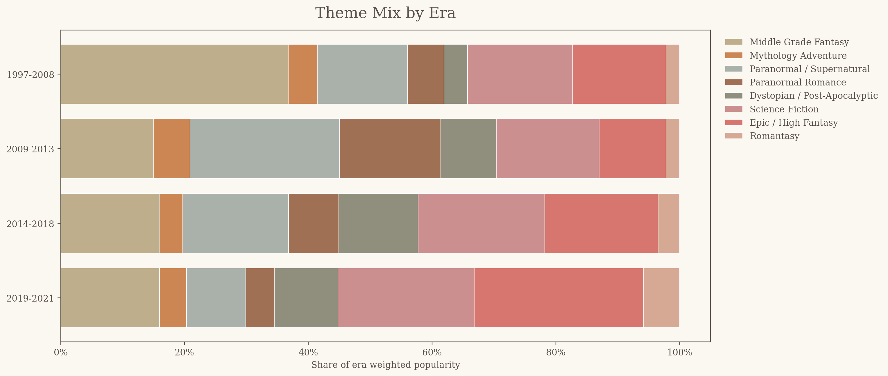
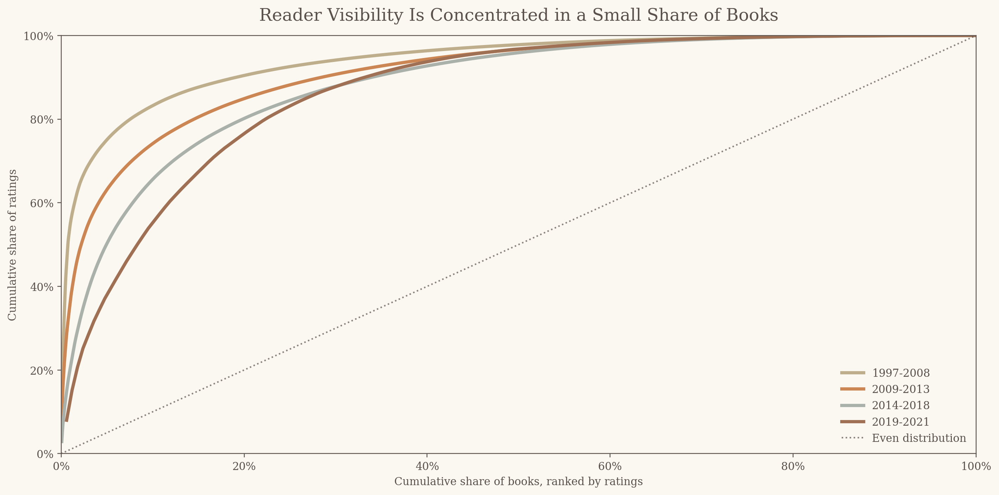
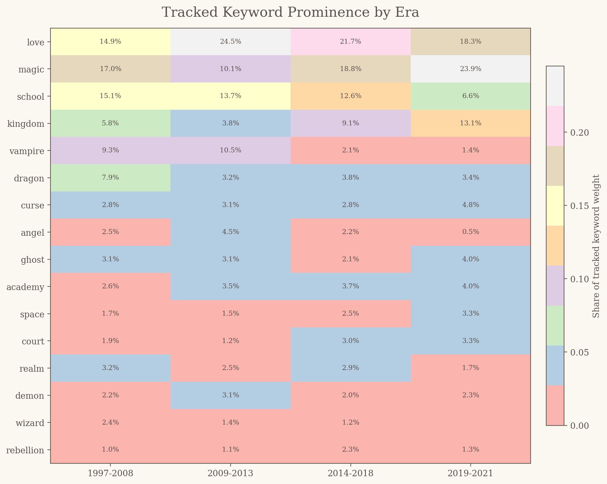

<h1 align="center">
  <br>
  <a href="assets/logo.png"></a>
  <br>
  Books That Evolve
  <br>
</h1>

<h4 align="center">A cultural memory analysis of Goodreads youth-fiction eras, 1997-2021.</h4>

<p align="center">
  
  
  
  
  
</p>

<p align="center">
  <a href="#overview">Overview</a> •
  <a href="#main-results">Results</a> •
  <a href="#report">Report</a> •
  <a href="#data-and-method">Data & Method</a> •
  <a href="#repo-structure">Repo Structure</a> •
  <a href="#reproduce-the-analysis">Reproduce</a>
</p>

## Overview

This project studies how culturally visible youth fiction changed across modern reading eras. It uses the Goodreads "Best Books Ever" dataset as a proxy for reader memory: not everything that was published, but the books that accumulated ratings, affection, list recognition, and long-term platform visibility.

The analysis asks whether familiar reading-era narratives appear in the data. Was there a middle grade fantasy era? A paranormal wave? A dystopian boom? A high-fantasy or romantasy turn? The answer is yes, but with nuance. Goodreads youth-fiction memory moves through recognizable eras, while also being strongly shaped by a small number of highly visible series.

This is not a publishing-market report. It is a cultural-memory analysis: a study of what stuck.

## Main Results

The final scoped dataset contains **6,552** young adult, middle grade, and crossover books first published between **1997 and 2021**. Theme eras were identified from changes in annual theme popularity share.

| Era | Short Description |
| --- | --- |
| **1997-2008** | **The Middle Grade Fantasy Era**: Harry Potter and Percy Jackson anchor a period where school, magic, quests, and long-running fantasy worlds dominate Goodreads memory. |
| **2009-2013** | **The Paranormal Wave**: Paranormal / Supernatural becomes the leading theme, while Paranormal Romance rises beside it. |
| **2014-2018** | **The Mixed Speculative Era**: Dystopia remains highly visible, but the broader Science Fiction bucket ranks first overall while high fantasy gains ground. |
| **2019-2021** | **The High Fantasy Turn**: Epic / High Fantasy leads the smaller recent sample, with romantasy becoming more visible but still modest in scale. |

### Theme Popularity Over Time



### Data-Driven Era Boundaries



### Theme Mix by Era



## Report

The full narrative report is here:

**[Read the full analysis report](Report.md)**

The report is structured as an era-driven data essay. It moves through the four reading eras, then steps back to examine two cross-era patterns: visibility concentration and vocabulary change.

Report-ready supporting assets:

- Final charts: `outputs/report/charts/`
- Final tables: `outputs/report/tables/`
- Final visuals notebook: `notebooks/final_analysis_visuals.ipynb`
- Detailed methodology: `Methodology.md`

## Key Patterns

**Middle grade fantasy anchors the earliest period.** In 1997-2008, Middle Grade Fantasy accounts for 36.8% of era weighted popularity, far ahead of the next themes. Harry Potter and Percy Jackson are central to how this era is remembered.

**The paranormal wave is the clearest genre surge.** In 2009-2013, Paranormal / Supernatural becomes the top theme at 24.2% of weighted popularity, while Paranormal Romance reaches 16.4%. Both streams peak annually in 2011.

**Dystopia is visible, but not the whole 2010s story.** Dystopian and post-apocalyptic books are culturally important, especially through *The Hunger Games*, *Divergent*, and *The Selection*. But in 2014-2018, the broader Science Fiction category ranks first overall, and Epic / High Fantasy is close behind.

**Blockbuster series amplify cultural memory.** In 1997-2008, books tagged as `blockbuster_franchise` make up only 3.6% of scoped books but account for 63.7% of ratings. Goodreads memory is not only shaped by broad theme movement; it is also concentrated around a small number of highly visible series.



**Vocabulary changes with the eras.** Early tracked keywords include `magic`, `school`, `dragon`, and `kingdom`. During the paranormal wave, `angel` and `academy` become newly prominent. In 2014-2018, `court` and `realm` become newly prominent, supporting the shift toward courtly and secondary-world fantasy language.



## Data and Method

The source data is the Goodreads "Best Books Ever" dataset from Kaggle:

<https://www.kaggle.com/datasets/pooriamst/best-books-ever-dataset>

The raw dataset contains **52,478** Goodreads records with book metadata, authors, publication dates, genres, descriptions, ratings, average ratings, and Goodreads "Best Books Ever" voting fields. The raw Kaggle file and generated book-level CSVs are intentionally not committed to GitHub. The repository keeps the scripts, compact summaries, final outputs, and documentation needed to reproduce the analysis locally.

The pipeline:

1. Cleans publication dates, authors, genres, descriptions, and numeric fields.
2. Filters to youth fiction and project-relevant speculative or adjacent themes.
3. Assigns audience labels, theme tags, and a `series_flag`.
4. Builds a composite `popularity_score`.
5. Exports final era tables, charts, exploratory tables, and report visuals.

Popularity score:

```text
popularity_score =
0.5 * z(log1p(numRatings_clean))
+ 0.3 * z(averageRating)
+ 0.2 * z(log1p(bbeVotes_clean))
```

The score is designed to combine reader visibility, reader affection, and Goodreads list canonization. It is not a sales measure.

## Limitations

This project analyzes Goodreads visibility, not the full publishing market. Goodreads data is shaped by platform behavior, reader demographics, missing metadata, and long-term rating accumulation. The theme system is rule-based and transparent, but imperfect. Books can belong to multiple themes, and categories such as Dystopian / Post-Apocalyptic and Science Fiction naturally overlap. The most recent era is also smaller than the earlier ones, so 2019-2021 should be treated as directional rather than definitive.

## Repo Structure

```text
books-that-evolve/
├── assets/                  # Logo and durable project visuals
├── data/                    # Local datasets and committed run summaries
│   ├── raw/                 # Local Kaggle CSV goes here; not committed
│   └── reference/           # Compact pipeline summary CSVs
├── notebooks/
│   └── final_analysis_visuals.ipynb
├── outputs/
│   ├── charts/              # Final pipeline charts
│   ├── tables/              # Final pipeline tables
│   ├── exploratory/         # Exploratory tables and findings draft
│   └── report/              # Report-ready charts and tables
├── scripts/                 # Reproducible processing pipeline
├── Methodology.md
├── Report.md
├── README.md
└── requirements.txt
```

## Reproduce the Analysis

Install dependencies:

```bash
git clone https://github.com/beatrizbbs/books-that-evolve.git
cd books-that-evolve
python -m venv .venv
.venv/bin/pip install -r requirements.txt
```

Download the Kaggle dataset and place the source CSV at:

```text
data/raw/books_goodreads.csv
```

Run the full pipeline:

```bash
.venv/bin/python scripts/01_clean_books.py
.venv/bin/python scripts/02_scope_books.py
.venv/bin/python scripts/03_score_books.py
.venv/bin/python scripts/04_export_theme_era_outputs.py
.venv/bin/python scripts/05_exploratory_analysis.py
```

Generate the report visuals notebook:

```bash
.venv/bin/jupyter nbconvert --to notebook --execute --inplace notebooks/final_analysis_visuals.ipynb
```

## Next Steps

- Add newer data to strengthen the post-2021 analysis.
- Manually audit top-ranked books to refine theme tags.
- Improve classification of romantasy and dystopian/science-fiction overlap.
- Compare Goodreads memory against publication-market or sales data if available.
- Turn the static report into an interactive dashboard later.

## License

This project is released under the MIT License.
