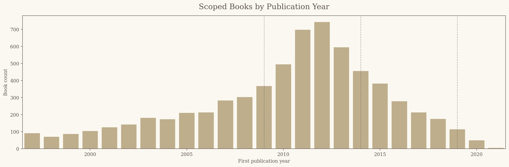

# Books That Evolve

## How Goodreads Youth Fiction Moved Through Reading Eras, 1997-2021

## Executive Summary

This report examines how culturally visible youth fiction changed across modern reading eras, using the Goodreads "Best Books Ever" dataset as a proxy for reader memory. The project does not try to measure the entire publishing market. Instead, it focuses on books that endured in Goodreads visibility: books with ratings, reader affection, genre labels, descriptions, and Goodreads list recognition. After cleaning and filtering the raw dataset, the final scoped analysis contains 6,552 young adult, middle grade, and crossover books first published between 1997 and 2021.

The central pattern is a movement through four broad eras. From 1997 to 2008, Goodreads youth-fiction memory is anchored by middle grade fantasy, especially series-centered fantasy worlds associated with Harry Potter and Percy Jackson. From 2009 to 2013, paranormal and supernatural fiction becomes the clearest wave, with paranormal romance rising beside it. From 2014 to 2018, the field becomes more mixed: dystopian books remain highly visible, but broader science fiction ranks first overall while epic and high fantasy gain ground. From 2019 to 2021, the smaller recent sample points toward a high-fantasy turn, with courtly fantasy, series fantasy, and romantasy-adjacent books becoming more visible.

The report also finds that reader memory is highly concentrated. A small share of books captures a large share of ratings, especially in the earlier eras. In 1997-2008, books tagged as `blockbuster_franchise` make up only 3.6% of scoped books but account for 63.7% of ratings. That does not mean the broader theme movements are artificial, but it does mean that remembered eras are amplified by a small number of exceptionally visible series. The report therefore treats eras as cultural-memory patterns rather than clean descriptions of everything published.

The next step is to audit borderline theme tags, strengthen the classification of romantasy and dystopian/science-fiction overlap, and add newer data to make the 2022-2024 period more reliable.

## Why Study Reading Eras?

Youth fiction is often remembered through eras. Readers talk about the Harry Potter era, the Twilight era, the Hunger Games era, the dystopian boom, and the current rise of romantasy or high fantasy. These labels are useful because they capture a shared cultural feeling: certain books seemed to define what young readers were talking about, recommending, rereading, and using as reference points. But memory can also flatten the past. A few massive series can become stand-ins for an entire period, while slower or less spectacular patterns disappear behind them.

This project starts from that tension. It asks whether those remembered eras appear in Goodreads data, and whether the data supports a simple genre-wave story or a more complicated one. Goodreads is not a neutral record of the publishing market. It is a record of platform behavior, reader attention, and accumulated visibility. That makes it imperfect for market analysis but useful for cultural-memory analysis. The question here is not "What did publishers release each year?" but "Which books remained visible enough for readers to keep rating, voting for, and categorizing them?"

The report is written for readers interested in book culture, data storytelling, and literary trends. It treats youth fiction as both a dataset and a memory object: a field shaped by genre labels, reader affection, platform bias, and the outsized force of beloved series.

## Research Question

The main research question is:

* How did the dominant themes in culturally visible youth fiction change from 1997 to 2021?

The supporting questions are more specific. 
* Which themes define each era? 
* Which books and authors anchor those eras? 
* How much do blockbuster series shape what appears to be culturally dominant? 
* Does the language of titles and descriptions shift along with the theme labels? T

hese questions matter because they help separate broad theme movement from the gravitational pull of a few unforgettable franchises.

## Data and Method

The source data is the Goodreads "Best Books Ever" dataset from Kaggle, available at <https://www.kaggle.com/datasets/pooriamst/best-books-ever-dataset>. The raw dataset contains 52,478 Goodreads records with book metadata, authors, publication dates, descriptions, genres, ratings, average ratings, and Goodreads "Best Books Ever" voting fields. The raw Kaggle CSV is not committed to this repository; it is downloaded locally and placed at `data/raw/books_goodreads.csv` so the pipeline can be rerun without storing large data files in GitHub.

The cleaning process standardizes publication years, authors, genre fields, descriptions, ISBN-like identifiers, and numeric fields. Records were restricted to books with valid first publication years in the project frame, then deduplicated by `bookId`. This produced 37,281 cleaned records. The scope step then filtered for youth fiction associated with project-relevant speculative or adjacent themes, assigning each book an audience label (`middle_grade`, `young_adult`, or `crossover`) and one or more theme tags. The final scoped dataset contains 6,552 books.

The analysis uses eight theme categories: Middle Grade Fantasy, Mythology Adventure, Paranormal / Supernatural, Paranormal Romance, Dystopian / Post-Apocalyptic, Science Fiction, Epic / High Fantasy, and Romantasy. These categories are rule-based and can overlap. For example, a dystopian book can also be science fiction, and a fantasy romance can also be epic or high fantasy. This overlap is intentional because the project studies theme visibility, not mutually exclusive shelving categories.

Popularity is measured with a composite score designed to capture three dimensions of cultural memory: visibility, affection, and Goodreads canonization. The score combines `log1p(numRatings_clean)`, `averageRating`, and `log1p(bbeVotes_clean)` after standardization:

```text
popularity_score =
0.5 * z(log1p(numRatings_clean))
+ 0.3 * z(averageRating)
+ 0.2 * z(log1p(bbeVotes_clean))
```

The largest weight goes to rating count because broad reader visibility is central to this project. Average rating receives a smaller but meaningful weight because reader affection matters, and Goodreads list votes provide an additional signal of canonization within the platform. This score is not a sales measure and should not be treated as objective literary quality. It is a practical indicator of Goodreads-based cultural visibility.

The era boundaries were identified by measuring changes in annual theme mix. Annual theme popularity shares were smoothed with a centered rolling window, then each year was scored by how much the full theme-share vector changed from the previous year. The selected breakpoints are 2009, 2014, and 2019, producing four eras: 1997-2008, 2009-2013, 2014-2018, and 2019-2021. The realized analysis range ends in 2021 because the scoped data becomes sparse after that point.

## The Era Map

The first chart shows the full theme timeline. Each line represents a theme's share of annual weighted popularity, not simply the number of books. This matters because the project is interested in books that remained visible, not just books that exist in the dataset. The broad movement is visible even before naming the eras: middle grade fantasy is strongest early, paranormal and paranormal romance rise sharply around the late 2000s and early 2010s, science fiction and dystopian modes remain visible through the 2010s, and high fantasy becomes more prominent in the later period.


The second chart shows the data-driven boundary method. The y-axis measures how much the smoothed theme mix changes from one year to the next. The selected breakpoints are not meant to imply that culture changes overnight. They are analytical markers for moments when the balance of visible themes shifts enough to divide the timeline into interpretable periods.


The resulting era map is:

- **1997-2008 · The Middle Grade Fantasy Era**
- **2009-2013 · The Paranormal Wave**
- **2014-2018 · The Mixed Speculative Era**
- **2019-2021 · The High Fantasy Turn**

This structure is the backbone of the report. Rather than presenting findings as disconnected statistics, the analysis moves through time and then steps back to examine the cross-era forces that shape the pattern.

## 1997-2008 · The Middle Grade Fantasy Era

The first era is anchored by middle grade fantasy. In 1997-2008, Middle Grade Fantasy accounts for 36.8% of era weighted popularity, far ahead of Science Fiction at 17.0% and Epic / High Fantasy at 15.1%. The strongest cultural memory of this period is school-age fantasy, magic, quests, and long-running fantasy worlds. This does not mean that every important book from the period was middle grade fantasy, but it does mean that the era's Goodreads visibility is strongly organized around that mode.

The top books make the pattern easy to understand. Harry Potter dominates the highest-ranked books, and Percy Jackson enters as another major middle grade fantasy anchor. The presence of *The Hunger Games* in 2008 is also important because it appears at the edge of this era and foreshadows the dystopian/science-fiction visibility that becomes stronger later. In cultural terms, this era is not only a fantasy era; it is a franchise-formation era, where long-running series create shared worlds that readers return to and continue rating years later.

The vocabulary evidence supports this early fantasy memory. Among tracked keywords, the top words for 1997-2008 include `magic`, `school`, `love`, `vampire`, `dragon`, `kingdom`, `realm`, and `ghost`. Some of those words point directly to fantasy worldbuilding, while others foreshadow the supernatural and romance vocabulary that becomes more central in the next era. The early period is therefore not sealed off from later waves; it contains the seeds of them.

## 2009-2013 · The Paranormal Wave

The second era is the clearest genre wave in the dataset. Paranormal / Supernatural becomes the leading theme in 2009-2013, accounting for 24.2% of weighted popularity, while Paranormal Romance reaches 16.4%. Both streams peak annually in 2011. This supports the cultural memory of a supernatural YA wave, but the data also shows that the wave is broader than a single series. *Twilight* is central to the remembered landscape, but Cassandra Clare, Vampire Academy, angel fiction, academy settings, and other supernatural-romantic forms all participate in the pattern.

This era is also crowded. Science Fiction remains second at 16.6%, and Middle Grade Fantasy still holds 15.0%. The top books include *Divergent*, *Catching Fire*, *Mockingjay*, Rick Riordan's mythology-driven books, and Cassandra Clare's Infernal Devices entries. That mixture matters because it complicates the idea of a single clean "paranormal era." Paranormal is the clearest wave, but it coexists with dystopian science fiction and continuing middle grade mythology/fantasy visibility.

The keyword transition table reinforces the shift. In 2009-2013, `angel` and `academy` become newly prominent among the tracked words, while `love`, `school`, `vampire`, `magic`, `kingdom`, and `dragon` remain prominent from the previous era. This is exactly the kind of hybrid vocabulary one would expect from paranormal YA: school and academy settings, supernatural beings, romance language, and fantasy-adjacent worldbuilding all occupying the same cultural space.

## 2014-2018 · The Mixed Speculative Era

The third era is not simply "the dystopia era," even though dystopia remains one of its most recognizable modes. Dystopian and post-apocalyptic stories are highly visible through *The Hunger Games*, *Divergent*, *The Selection*, and related books, but the broader Science Fiction bucket ranks first overall in 2014-2018 with 20.5% of weighted popularity. Epic / High Fantasy follows at 18.3%, Paranormal / Supernatural remains close at 17.1%, and Middle Grade Fantasy still contributes 16.0%. Dystopian / Post-Apocalyptic reaches 12.8%, which is meaningful but not dominant by itself.

This is why the era is better described as mixed speculative fiction than as pure dystopia. The remembered dystopian boom is real, but it sits inside a broader speculative landscape. Some dystopian books are also science fiction, and many popular books of the period are better understood as part of a larger system of future societies, political fantasy, technological worlds, court politics, rebellion, and high-stakes romance. The theme categories overlap because the books themselves often overlap.

The top books show a visible turn toward high fantasy and romantasy-adjacent works. *A Court of Mist and Fury*, *Six of Crows*, *Heir of Fire*, *Queen of Shadows*, *Crooked Kingdom*, and *A Court of Thorns and Roses* all appear among the leading books for the era. At the vocabulary level, `court` and `realm` become newly prominent, while `vampire` and `angel` drop out of the top tracked words. This suggests a shift away from the paranormal-romance vocabulary of the previous era and toward courtly, political, secondary-world fantasy language.

## 2019-2021 · The High Fantasy Turn

The final era points toward Epic / High Fantasy, which accounts for 27.3% of weighted popularity, followed by Science Fiction at 22.1% and Middle Grade Fantasy at 16.0%. Romantasy reaches its highest era share at 5.9%, but it remains smaller than the broader fantasy and science-fiction categories. This is the most tentative era in the report because it contains only 168 scoped books, far fewer than the earlier periods. The evidence is directionally useful, but it should not be overread as a definitive account of recent publishing or reading culture.

The top books point toward a continued interest in fantasy courts, kingdoms, and series worlds. Holly Black's *The Wicked King* and *The Queen of Nothing* lead the era's top-ranked books, alongside Katherine Arden, Cassandra Clare, Leigh Bardugo, Marissa Meyer, and Neal Shusterman. The era still contains science fiction and dystopian/post-apocalyptic books, but its most visible fantasy titles suggest a landscape in which high fantasy, court intrigue, dark academia-adjacent supernatural fiction, and romance-adjacent fantasy are increasingly important.

The keyword table is less decisive here, partly because the sample is small. `magic`, `love`, `kingdom`, `school`, `curse`, `ghost`, `academy`, and `dragon` are the top tracked words. `curse` and `ghost` appear as newly prominent relative to the previous era, while `court` and `realm` drop from the top tracked list. This does not mean courtly fantasy disappears; rather, it means the tracked keyword table should be treated as descriptive evidence from titles and descriptions, not a complete map of the books' themes.

## Theme Mix by Era

The era-level theme mix chart compresses the timeline into four horizontal bars. It shows why the period labels are useful but imperfect. Each era has a leading theme, but no era is a single-theme block. Middle Grade Fantasy is dominant in the first era, Paranormal / Supernatural leads the second, Science Fiction leads the third, and Epic / High Fantasy leads the fourth. At the same time, science fiction, fantasy, paranormal, and dystopian modes overlap across the whole timeline.


This is one of the most important interpretive points in the project. Reading eras are real enough to be visible in the data, but they are not clean genre boxes. They are shorthand for changing balances of attention. The term "paranormal wave" is useful because paranormal fiction clearly rises in 2009-2013, but it should not erase the continuing strength of science fiction, dystopian books, middle grade fantasy, and mythology adventure. Likewise, the term "high fantasy turn" is useful for describing 2019-2021, but it remains tentative because the sample is smaller.

## Era-Defining Books

The top books by era connect the abstract theme mix to recognizable cultural anchors. They also show how powerfully series shape the dataset. In 1997-2008, the top of the list is dominated by *Harry Potter*, with *The Hunger Games* and *The Lightning Thief* also appearing. In 2009-2013, the leading books include *Divergent*, *Catching Fire*, *The Last Olympian*, *Clockwork Angel*, *Clockwork Princess*, *Clockwork Prince*, and *Mockingjay*. In 2014-2018, Sarah J. Maas, Cassandra Clare, Leigh Bardugo, Marissa Meyer, and Kiera Cass become central to the era-defining list. In 2019-2021, Holly Black, Katherine Arden, Cassandra Clare, Marissa Meyer, Leigh Bardugo, and Neal Shusterman appear among the top-ranked books.

The table is not included here as a static image because book titles are easier to inspect as data. The report-ready version is saved at `outputs/report/tables/top_books_by_era_report.csv`. Its purpose is not only to name popular books; it is to show how each era's abstract theme profile is carried by specific titles and authors.

## Cross-Era Pattern: Visibility Is Concentrated

The blockbuster question needs a slightly different approach from the theme charts. A simple "with and without top books" comparison can be useful, but it does not fully explain the mechanism. The more direct question is concentration: how much reader visibility is captured by the most visible books in each era? To answer that, books were ranked by `numRatings_clean` within each era, and the cumulative share of ratings was plotted against the cumulative share of books. If visibility were evenly distributed, the curve would follow the diagonal line. The steeper the curve, the more concentrated the era's Goodreads visibility is among a small share of books.


The results show strong concentration, especially in the earlier eras. In 1997-2008, the top 1% of books accounts for 55.1% of ratings, and the top 5% accounts for 75.2%. Books tagged as `blockbuster_franchise` make up only 3.6% of scoped books in that era but account for 63.7% of ratings. In 2009-2013, blockbuster/franchise books are 4.1% of books and account for 46.4% of ratings. By 2014-2018, the blockbuster share is still disproportionate but less extreme: 6.0% of books account for 32.4% of ratings. In 2019-2021, the result is weaker and less stable because the sample is much smaller.

This supports a careful version of the blockbuster hypothesis. The data does not prove that blockbuster series create the eras by themselves. It does show that Goodreads cultural memory is heavily amplified by a small number of highly visible books. That means the remembered shape of an era is partly a broad theme pattern and partly a visibility effect. The early period looks like the Harry Potter era not only because middle grade fantasy is common, but because Harry Potter concentrates an enormous amount of reader attention. The paranormal era looks like a wave not only because supernatural books increase, but because several highly visible series make that wave culturally memorable.

## Cross-Era Pattern: The Vocabulary Changes

The keyword evidence is intentionally secondary. It uses titles and descriptions, not full book text, so it should be read as metadata language rather than literary language in the strict sense. Still, it is useful because title and description language reflects how books are presented, categorized, and remembered. Instead of showing many overlapping keyword lines, the heatmap below shows the prominence of tracked keywords by era.


The vocabulary pattern follows the theme story in broad strokes. In 1997-2008, the top tracked words include `magic`, `school`, `love`, `vampire`, `dragon`, `kingdom`, `realm`, and `ghost`. In 2009-2013, `angel` and `academy` become newly prominent while `love`, `school`, `vampire`, and `magic` remain. In 2014-2018, `court` and `realm` become newly prominent, while `vampire` and `angel` drop from the top tracked set. In 2019-2021, `curse` and `ghost` become newly prominent, though this period should be treated cautiously because of the smaller sample.

The vocabulary evidence supports one of the report's more interpretive claims: fantasy persists, but its center of gravity changes. The early fantasy memory is school, magic, quest, and wonder. The later fantasy memory includes more court, realm, kingdom, curse, and series-world language. This does not mean one vocabulary fully replaces another. It means the language of visible youth fiction shifts as different fantasy and speculative modes rise.

## Context: Books by Year

The books-by-year chart is included as context rather than as a central finding. It shows how many scoped books are available for each first publication year. This matters most for interpreting the final era. The 2019-2021 period has far fewer scoped books than the earlier eras, which is one reason this report treats the high-fantasy turn as directional rather than definitive.



## What This Means

The project supports a recognizable reading-era story, but the story is more layered than simple labels suggest. Middle grade fantasy, paranormal romance, dystopian science fiction, broader science fiction, high fantasy, and romantasy-adjacent books all matter. The era names work because they summarize the strongest visible shifts, but they should not be treated as exhaustive labels. Each era contains multiple active themes, and many books belong to more than one theme at once.

The analysis also shows that Goodreads memory is not just a mirror of genre movement. It is shaped by concentration. A small number of books and series capture a large share of visibility, especially when measured through ratings. This is not a flaw in the project; it is part of the phenomenon being studied. Cultural memory often works through anchors. Readers remember periods through major titles, and those titles become shorthand for larger trends.

The most useful interpretation is therefore two-part. First, there are broad shifts in theme visibility over time. Second, those shifts are amplified by blockbuster and franchise books that dominate reader attention. The result is a cultural timeline that is both data-supported and memory-shaped.

## Limitations

This report uses Goodreads visibility, not the full publishing market. The dataset overrepresents books that accumulated ratings, votes, and long-term attention on Goodreads, and it underrepresents obscure books, books with smaller online readerships, recently published titles, and books less likely to be shelved or rated by Goodreads users. The findings should be interpreted as patterns in Goodreads-canonized youth fiction, not as a definitive account of every youth-fiction book published between 1997 and 2021.

The theme system is rule-based and imperfect. It uses genre labels, titles, descriptions, and keyword patterns to assign books to themes. This makes the classification transparent and reproducible, but it also means some books may be misclassified, especially when metadata is sparse or when a book crosses genres. The overlap between Dystopian / Post-Apocalyptic and Science Fiction is especially important. Dystopia is often a mode of science fiction, so those categories should be read as analytical lenses rather than hard genre boundaries.

The series and blockbuster flag is approximate. It uses available series metadata, known franchise patterns, and popularity thresholds to identify likely blockbuster or franchise books. This is useful for studying visibility concentration, but it should not be treated as a perfect industry classification. Some series may be missed, and some highly visible books may not fit neatly into a franchise label.

The keyword analysis uses titles and descriptions, not full book text. It captures how books are presented in metadata, not the complete vocabulary of the novels themselves. The recent period is also underpowered: the scoped data effectively ends in 2021, and the 2019-2021 era contains only 168 books. Claims about the newest era should therefore be treated as suggestive rather than final.

## Next Steps

The most important next step is to strengthen the recent data. Adding newer Goodreads records, Open Library metadata, Google Books metadata, or another source would make it possible to evaluate the rise of romantasy and high fantasy with more confidence. The 2019-2021 signal is interesting, but it is too small to carry the same weight as earlier eras.

The second next step is theme validation. A manual audit of the top 100 or top 250 books would help refine the rule-based tags, especially for romantasy, dystopian/science-fiction overlap, and paranormal versus secondary-world fantasy. The current tags are transparent and useful, but a small amount of hand validation would make the final claims more defensible.

The third next step is comparison. Goodreads captures reader memory, but it would be valuable to compare these findings against publication counts, bestseller lists, library circulation, sales data if available, or award lists. That would help separate what was widely published from what remained culturally visible.

## Conclusion

Goodreads youth-fiction memory moves through recognizable eras, but those eras are not simple genre boxes. The data shows an early middle grade fantasy anchor, a clear paranormal wave, a mixed speculative period where dystopia is visible but not the whole story, and a tentative high-fantasy turn in the most recent data. Across all of this, blockbuster series shape the visible canon by concentrating reader attention. The strongest conclusion is not that one genre replaces another, but that youth-fiction memory evolves through shifting balances: broad theme movement, changing vocabulary, and the outsized visibility of a few books that readers continue to remember.

## Appendix: Reproducibility and Supporting Files

The full processing pipeline is implemented in `scripts/`:

```bash
.venv/bin/python scripts/01_clean_books.py
.venv/bin/python scripts/02_scope_books.py
.venv/bin/python scripts/03_score_books.py
.venv/bin/python scripts/04_export_theme_era_outputs.py
.venv/bin/python scripts/05_exploratory_analysis.py
```

The final visuals notebook is `notebooks/final_analysis_visuals.ipynb`. Report-ready charts are saved in `outputs/report/charts/`, and report-ready supporting tables are saved in `outputs/report/tables/`. Detailed methodology is documented in `Methodology.md`.
